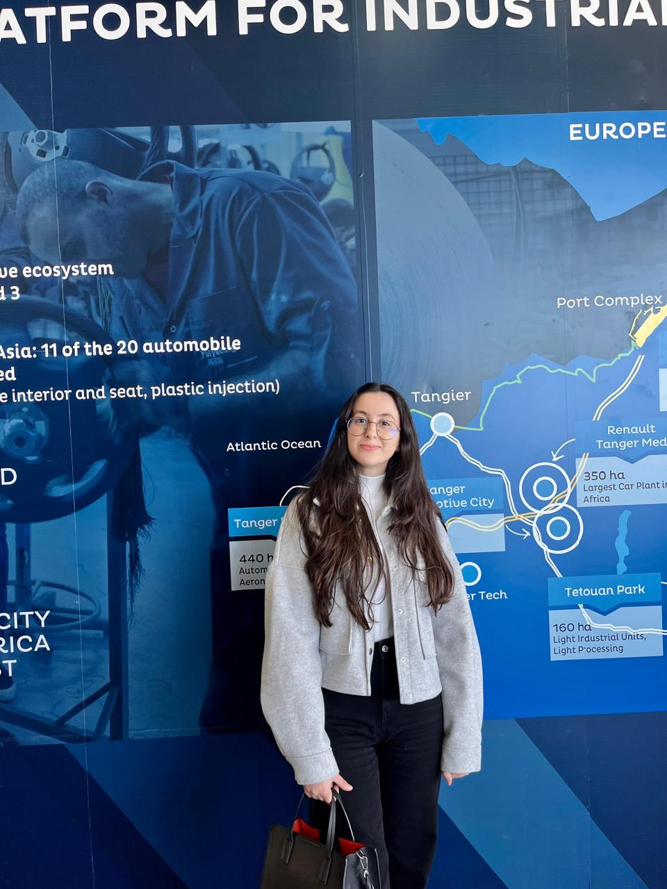
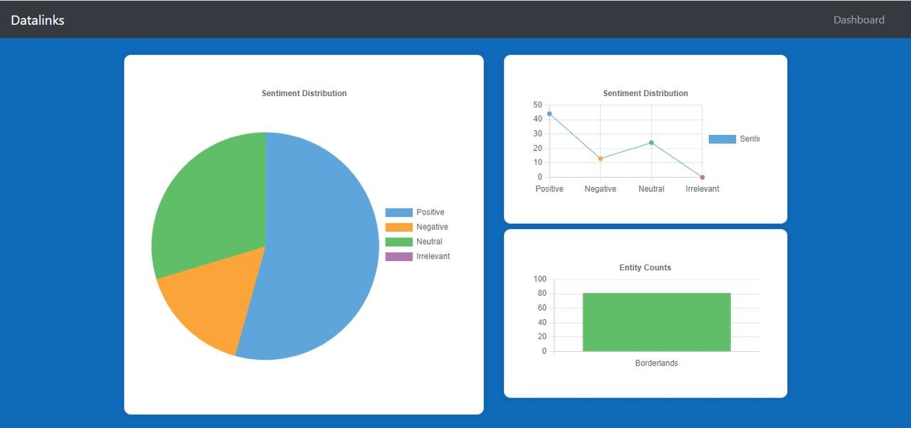
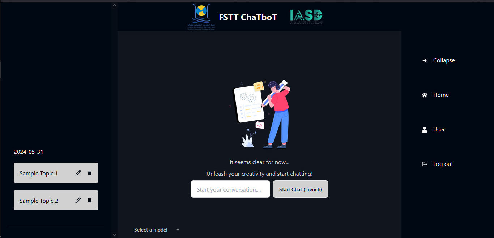

<!DOCTYPE html>
<html lang="fr">
<head>
    <meta charset="UTF-8">
    <meta name="viewport" content="width=device-width, initial-scale=1.0">
    <title>Widad Essetti - AI and Data Science Master's Student</title>
    
</head>
<body>
    <header>
        
        <h1>Widad Essetti</h1>
        
AI and Data Science Master's Student

    </header>
    <nav>
        

            <a href="#about">À propos de moi</a>
            <a href="#skills">Compétences techniques</a>
            <a href="#education">Éducation</a>
            <a href="#experience">Expérience professionnelle</a>
            <a href="#projects">Projets</a>
            <a href="#contact">Contact</a>
        

    </nav>
    

        

            <h2>À propos de moi</h2>
            
Je m'appelle Widad Essetti et j'ai 22 ans. Je suis actuellement étudiant en master, poursuivant un diplôme en Intelligence Artificielle et Science des Données.

        

        

            <h2>Compétences techniques</h2>
            
Python, C++, JAVA, SQL, T-SQL, Docker, Scikit Learn, Apache Kafka, MongoDB, Apache Hadoop

        

        

            <h2>Éducation</h2>
            <ul>
                <li>2023-2025: Master en Intelligence artificielle et science de données | la faculté De science et technique de Tanger</li>
                <li>2023: Licence Génie Informatique | la faculté De science et technique de Tanger</li>
                <li>2020-2022: DEUST-MIP | la faculté De science et technique de Tanger</li>
                <li>2020: Baccalauréat International Option Français Filière : Science Physique | GAUSS-Kénitra</li>
            </ul>
        

        

            <h2>Expérience professionnelle</h2>
            
<strong>Stage de deux mois à l'Office National des Chemins de Fer (ONCF) (_Avril 2023 - Juin 2023_)</strong>

            <ul>
                <li>Etude et réalisation d'états d'édition relatifs à la gestion et au suivi de la situation financière des fournisseurs.</li>
            </ul>
        

        

            <h2>Projets</h2>
            

                <h3>Real-Time Tweet Sentiment Analysis for Streaming Data Classification</h3>
                
<a href="https://github.com/novoSoftEng/Real-Time-sentiment-Prediction">https://github.com/novoSoftEng/Real-Time-sentiment-Prediction</a>

                
Développer un pipeline de traitement de données robuste pour l'analyse et la prédiction en temps réel, en utilisant Apache Kafka et Apache Spark. En exploitant Apache Kafka, j'ai efficacement acheminé les données vers Apache Spark pour une classification immédiate. Au sein de Spark, j'ai mis en œuvre un modèle de prédiction utilisant la regression logistique pour analyser les flux de données entrants et générer des insights en temps réel. De plus, j'ai conçu et intégré une interface de tableau de bord conviviale pour surveiller les prédictions en temps réel, fournissant aux utilisateurs des informations précieuses sur les tendances et les modèles. Le projet a incorporé des technologies telles qu'Apache Kafka, Apache Spark, Docker, MongoDB, Zookeeper et un pipeline de machine learning.

                
            

            

                <h3>Custome ChatBot with RAG and Fine-tuning</h3>
                
<a href="https://github.com/Loubnaelghazi/Projet_llm_vf">https://github.com/Loubnaelghazi/Projet_llm_vf</a>

                
J'ai mis en œuvre un chatbot personnalisé utilisant un système de génération augmentée par la récupération (RAG), conçu pour fournir des réponses contextuelles aux questions des utilisateurs. Ce système combine des capacités de récupération, de lecture et de génération pour offrir des réponses précises. Le chatbot dispose d'une interface conviviale où les utilisateurs peuvent saisir leurs questions et recevoir des réponses générées en fonction du contexte récupéré à partir d'une base de données vectorielle. Ce projet a tiré parti de technologies avancées telles que Langchain, les grands modèles de langage (LLMs), chromadb, RAG, le traitement du langage naturel (NLP) et Ollama.

                
            

            

                <h3>Crédits à risque</h3>
                
Techniques d'apprentissage automatique : Gaussian Processes for Classification VS Logistic Regression

            

        

        

            <h2>Contact</h2>
            
Vous pouvez me contacter via les réseaux sociaux ou par email :

            
<strong>Email</strong> : <a href="mailto:widad200277@gmail.com">widad200277@gmail.com</a>

            
<strong>LinkedIn</strong> : <a href="https://www.linkedin.com/in/widad-essetti-3a7030272/">https://www.linkedin.com/in/widad-essetti-3a7030272/</a>

            
<strong>Github</strong> : <a href="https://github.com/WidadEs">@WidadEs</a>

        

    

    <footer>
        
&copy; 2024 Widad Essetti. Tous droits réservés.

    </footer>
</body>
</html>
